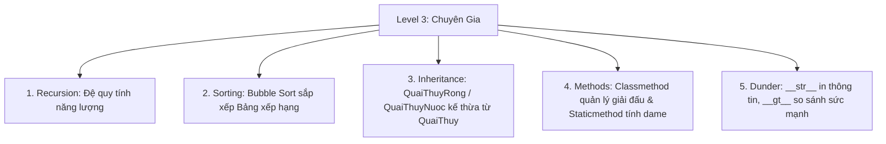

# Tuần 6 (Cấp 3): Đấu Trường Huyền Thoại 🏆 (Dự Án Tổng Hợp Level 3)

Chúc mừng bạn đã đi tới bài học cuối cùng của **Cấp độ 3: Chuyên Gia**! Hôm nay chúng ta sẽ kết hợp tất cả "siêu năng lực" đã học trong 5 tuần qua: **Hàm Đệ Quy**, **Thuật Toán Sắp Xếp**, **Kế Thừa OOP**, **Các Loại Phương Thức** và **Dunder Methods** để tạo nên một dự án game đỉnh cao: **Đấu Trường Quái Thú Python**!

---

## 🌟 Mục tiêu cần đạt
* Tích hợp toàn diện các khái niệm nâng cao của Level 3 vào một dự án thực tế.
* Xây dựng hệ thống Lớp quái thú kế thừa, sử dụng Dunder Methods để giao đấu.
* Dùng Class Method quản lý giải đấu và Static Method tính toán chỉ số chiến đấu.
* Dùng Thuật toán sắp xếp (Sorting Algorithm) để sắp xếp bảng xếp hạng quái thú chiến thắng.
* Dùng Đệ quy (Recursion) tính toán năng lượng tích lũy của Nhà Vô Địch!

---

## 🔑 Kiến thức tổng hợp Level 3

---

## 🤖 Dự án thực hành: Giải Đấu Võ Thuật Quái Thú Python!
Bên cột phải là toàn bộ mã nguồn của dự án Đấu Trường Quái Thú.
Hãy nhấn nút **"Bấm để Chạy thử! 🚀"** để thưởng thức giải đấu gay cấn và ăn mừng pháo hoa hoàn thành Cấp độ 3 nhé!

### 💡 Thử thách nâng cao dành cho Chuyên gia Python:
1. Thử tạo thêm một loài quái thú mới: `QuaiThuySet` kế thừa từ `QuaiThuy` có thêm tuyệt chiêu `Giật Điện`.
2. Thử thay đổi danh sách quái thú tham gia giải đấu và dự đoán xem ai sẽ là Nhà Vô Địch!
